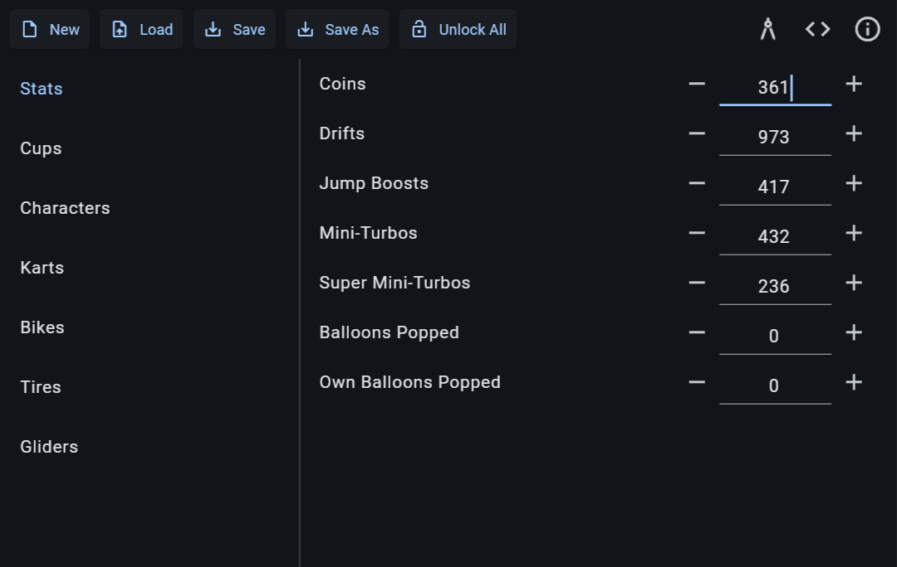
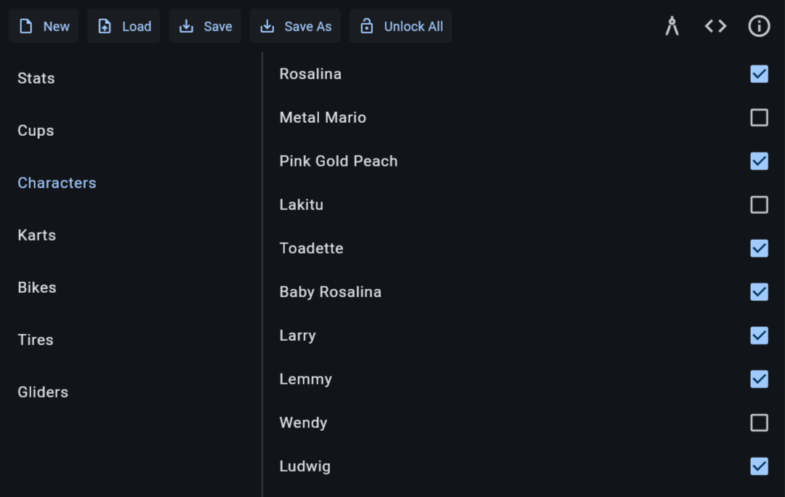

## **MK8SE**

Save editor for Mario Kart 8 (Wii U).

MK8SE is available both for Windows and Linux and as a [web app](https://petlyh.github.io/MK8SE/).

## Screenshots

## License

MK8SE is free software: you can redistribute it and/or modify it under the terms of the GNU Affero General Public License version 3 as published by the Free Software Foundation.

MK8SE is distributed in the hope that it will be useful, but WITHOUT ANY WARRANTY; without even the implied warranty of MERCHANTABILITY or FITNESS FOR A PARTICULAR PURPOSE. See the GNU Affero General Public License version 3 for more details.

You should have received a copy of the GNU Affero General Public License version 3 along with MK8SE. If not, see <https://www.gnu.org/licenses/>.
